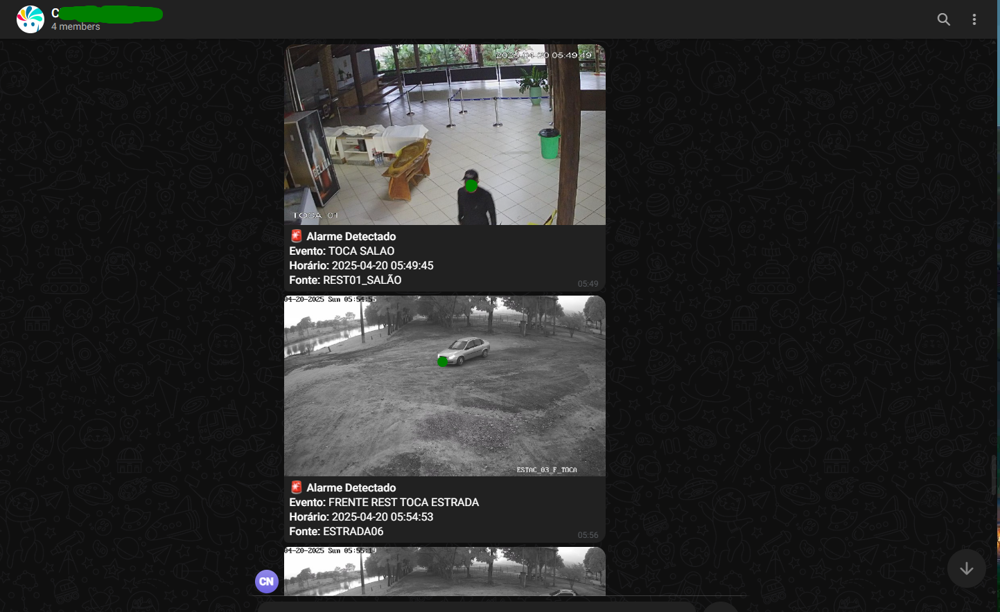

# Bot Notificação de Eventos HIKVISION / TELEGRAM

Script Python desenvolvido para integrar os alertas de e-mail enviados pelo HikCentral e convertê-los em notificações para o Telegram. 
Ideal para monitorar instantâneamente os eventos de segurança configurados no HikCentral.

> ⚠️ **Importante:**  
> O arquivo `telegram_notifier.py` **não é distribuído gratuitamente**.  
> Para obter o script, entre em contato via e-mail disponível no [perfil do autor no GitHub](https://github.com/davidebsen).

## Funcionalidades

- **Monitoramento de E-mail:** Verifica e-mails recebidos que contêm alertas do HikCentral.
- **Conversão para Notificações:** Transforma conteúdos dos e-mails em mensagens estruturadas para o Telegram.
- **Automação Completa:** Processo contínuo sem necessidade de intervenção manual verificação configurada a cada 60 segundo, com exclusão automática de e-mails após o processamento.

## Requisitos do Sistema
- **Debian**
- **Python 3.9 ou superior**
- **Acesso de e-mail IMAP habilitado**
- **Bot do Telegram com `TOKEN` e `CHAT ID`**

## Instalação

# 1. Atualize seus pacotes para ter certeza de que você possui a versão mais recente:

```bash
sudo apt-get update && sudo apt-get upgrade -y
```

# 2. Instale o Python 3.9 e ferramentas relevantes para gerenciar pacotes:

```bash
sudo apt-get install -y python3.9 python3.9-venv python3-pip
```

# 3. Crie um ambiente virtual para isolar as dependências do projeto:

```bash
python3.9 -m venv venv
source venv/bin/activate
```

# 4. Instalação da biblioteca necessária para HTTP requests:

```bash
pip install requests
```

# 5. Configuração do Script.
Edite o arquivo telegram_notifier.py e forneça suas credenciais nas seguintes variáveis:

# Configurações do e-mail (insira seus dados)
EMAIL = "seu_email@example.com"        # Substitua pelo seu e-mail
PASSWORD = "sua_senha"                 # Substitua pela sua senha
IMAP_SERVER = "imap.exemplo.com"       # Substitua pelo seu servidor IMAP

# Configurações do Telegram (insira seus dados)
TELEGRAM_TOKEN = "seu_token"           # Substitua pelo seu token Telegram
CHAT_ID = "seu_chat_id"                # Substitua pelo seu Chat ID

```bash
python3.9 telegram_notifier.py
```


# 6. Execução do Script.
Execute o script manualmente a primeira vez e feche o CLI:

```bash
python3.9 telegram_notifier.py
```
# 7. Configuração do Cron para Automação.

Para automatizar a execução do script em intervalos regulares, configure uma tarefa cron:
Edite as tarefas cron com o seguinte comando:

```bash
crontab -e
```
Adicione a seguinte linha ao arquivo crontab para executar o script a cada 4 horas:

```bash
0 */4 * * * /usr/bin/env python3 /backup/telegram/telegram_notifier.py >> /backup/telegram/telegram_cron_log.txt 2>&1
```
Certifique-se de substituir /caminho/para/python3.9 e /caminho/para/seu/telegram_notifier.py com os caminhos reais para seu interpretador Python e script.

## Integração com o HikCentral
Configuração da Central de Eventos: Garanta que os eventos de alerta do HikCentral sejam enviados para o seu e-mail configurado.

- Automação Completa: Todas as mensagens processadas são excluídas automaticamente para manter a caixa de entrada limpa e organizada.

## Licença
Este projeto é licenciado sob a licença MIT - veja o arquivo LICENSE para mais detalhes.

## Autor
Desenvolvido por [David Ebsen](https://www.linkedin.com/in/david-ebsen/)


